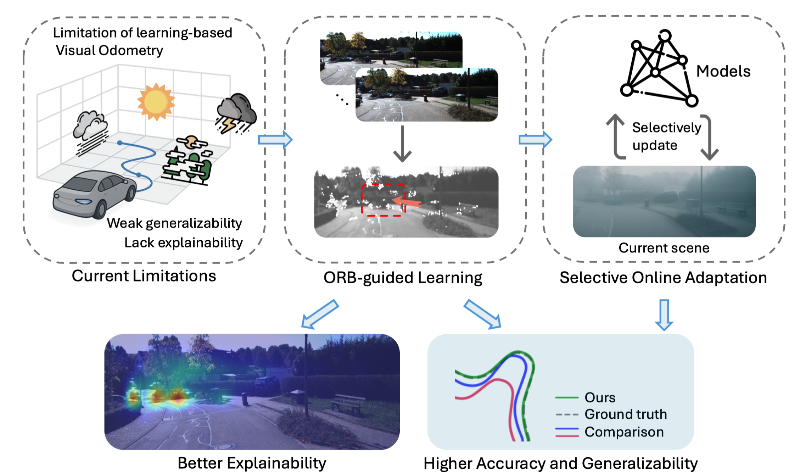
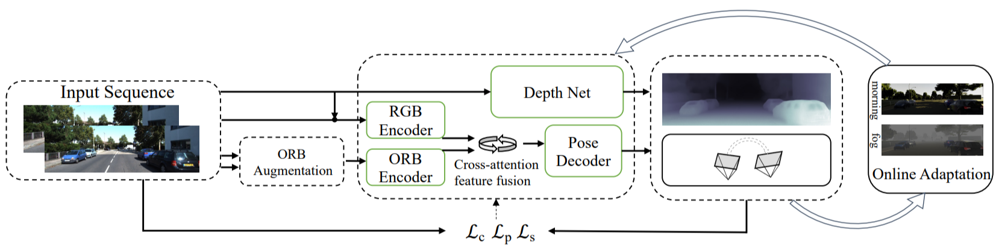

# ORB-SfMLearner

This repository provides the official reimplementation of **ORB-SfMLearner (ICRA 2025)**, built upon the [SC-SfMLearner](https://github.com/JiawangBian/sc_depth_pl). We introduced an ORB key points guided self-supervised visual odometry with online adaptation for accuracy, generalizability and explainability.

[](http://www.neiljin.site/projects/orbsfm/)
[](https://arxiv.org/pdf/2409.11692v4)
[](https://ieeexplore.ieee.org/document/11127848/)
[](https://drive.google.com/drive/folders/1twZsg2pxMLwcUUnFszBn1ryaEtuoEfs3?usp=sharing)
[](https://github.com/JiawangBian/sc_depth_pl)

<p align="center">
    
</p>

## Overview

<p align="center">
    
</p>

## Prerequisite

```bash
conda env create -f environment.yaml
conda activate orbsfm
```

## Datasets

We use three datasets in our experiments: **[Kitti raw](https://www.cvlibs.net/datasets/kitti/raw_data.php)**, **[Kitti Odometry (Color)](https://www.cvlibs.net/datasets/kitti/eval_odometry.php)**, and **[Virtual Kitti 2](https://europe.naverlabs.com/research/computer-vision/proxy-virtual-worlds-vkitti-2/)**.

- **KITTI Raw** is used for training. The dataset can be downloaded from the official website. To preprocess the raw sequences, please follow the data preparation scripts provided by [SfMLearner](https://github.com/tinghuiz/SfMLearner?tab=readme-ov-file#preparing-training-data) or [SC-SfMLearner](https://github.com/JiawangBian/SC-SfMLearner-Release?tab=readme-ov-file#datasets). We recommend download the pre-processed Kitti raw dataset provided by [Bian et al.](https://github.com/JiawangBian/SC-SfMLearner-Release#datasets) for simplicity:  
[kitti_256 (for kitti raw)](https://1drv.ms/u/s!AiV6XqkxJHE2g1zyXt4mCKNbpdiw?e=ZJAhIl) |  [kitti_depth_test (eigen split)](https://1drv.ms/u/s!AiV6XqkxJHE2kz5Zy7jWZd2GyMR2?e=kBD4lb)

- **KITTI Odometry (Color)** is used only for evaluation. No image preprocessing is required. You only need to provide the resized camera intrinsics for each sequence, saved as `DATA_ROOT/sequences/XX/image_2/cam.txt`.  
  We provide the required camera intrinsics files for 832*256 resolution [here](https://drive.google.com/drive/folders/1n81QDHaG3lIxnxybl9I6knPHxPngTsD8?usp=sharing).

- **Virtual KITTI 2** is used only for generalizability evaluation and please download it following the official [website](https://europe.naverlabs.com/proxy-virtual-worlds-vkitti-2/).


## Training

Use the scripts to train on KITTI Raw:
```bash
sh scripts/train.sh
```
The training process can be monitored with Tensorboard:
```bash
tensorboard --logdir=LogPath
```

## Pretrained Models
Pre-trained PoseNet and DispNet models are available [here](https://drive.google.com/drive/folders/1twZsg2pxMLwcUUnFszBn1ryaEtuoEfs3?usp=sharing). The checkpoints correspond to the best performance on the validation set during our reproduction experiments (at epoch 112/150).

DispNet adopts a ResNet50 backbone and PoseNet a ResNet18 encoder to align with the baseline methods. Performance on out-of-distribution data is limited by training data diversity. However, we encourage scaling up both data and model architecture, such as using Transformer-based models to further explore the potential of self-supervised VO.

### Reproduced Results
The reproduced results are slightly better than those reported in the original paper.

<div align="center">

| Sequence | ATE (m) ↓ | Trans. err. (%) ↓ | Rot. err. (deg / 100m) ↓ |
|:--------:|:---------:|:-----------------:|:------------------------:|
| 00 | 33.469 | 3.943 | 1.667 |
| 01 | 17.422 | 5.342 | 0.875 |
| 02 | 29.978 | 3.100 | 1.172 |
| 03 | 5.748  | 5.633 | 3.412 |
| 04 | 1.788  | 3.396 | 1.903 |
| 05 | 14.185 | 3.168 | 1.926 |
| 06 | 11.073 | 3.698 | 1.537 |
| 07 | 12.401 | 5.955 | 3.401 |
| 08 | 13.999 | 3.713 | 1.710 |
| 09 | 7.422  | 3.566 | 1.532 |
| 10 | 7.073  | 4.760 | 2.003 |

</div>

## Evaluation
Evaluate the Posenet without Selective Online Adaptation (SOA) by running
```bash
sh scripts/test_kitti_vo.sh
```

Evaluate the Posenet with SOA: 
```bash
sh scripts/test_kitti_vo_online.sh
```
<details>
<summary><span style="font-weight: bold;">Details for online adaptation (test_vo_online.py)</span></summary>

  #### --thread
  If enabled, all images will undergo multi-threaded preprocessing in advance for image loading and ORB feature point extraction. They will be stored in RAM. If your device memory is insufficient, you should disable the `--thread` argument.

  #### --epochs
  This defines the number of epochs for tuning the model on the current data snippet.

  #### --select-best
  During online adaptation, the script will iterate and return the optimal parameters. If you set select_best=1, it will select the best parameters. Otherwise, the model will proceed directly to inference after iteration with the last updated parameters.

  When the args.epochs is set to 1, even if args.select_best is enabled, the optimal parameters will not be saved because there is no basis for comparison. In this case, the final result will be equivalent to ‌not performing online updates‌.

  #### --part
  This allows tuning only a subset of weights during online updates, and you could adjust which parts to freeze in the ```test_vo_online.py``` file. By default, we only activate decoders as an example.

  #### Other arguments are the same as those used during training.  

  #### Note:
  1) Online adaptation introduces some randomness. 
  2) For trajectories that are already well predicted, the performance improvement is limited, whereas for poorly predicted (such as on vKitti) trajectories, the gains are much more significant.
</details>
<br>

We do not focus on depth estimation, but you can visualize depth by running
```bash
sh run_inference.sh
```

## Visualize Attention Weights
We visualize the attention weights for explainability by running: 
```bash
python visualize_attention.py --frame_folder FRAME_FOLDER --weights POSENET_CKPT
```
<p align="center">
  
</p>

    
## Acknowledgments
This implementation is adapted from [SC-SfMLearner](https://github.com/JiawangBian/sc_depth_pl) and [SfMLearner-Pytorch](https://github.com/ClementPinard/SfmLearner-Pytorch). We sincerely thank the original authors for their valuable work, which served as the baseline of this project.
 
## Citation

If this work is useful for your project, kindly cite these:

```bibtex
@inproceedings{jin2025orb,
  title={ORB-SfMLearner: ORB-Guided Self-supervised Visual Odometry with Selective Online Adaptation},
  author={Jin, Yanlin and Ju, Rui-Yang and Liu, Haojun and Zhong, Yuzhong},
  booktitle={2025 IEEE International Conference on Robotics and Automation (ICRA)},
  pages={1046--1052},
  year={2025},
  organization={IEEE}
}

@article{bian2021ijcv, 
  title={Unsupervised Scale-consistent Depth Learning from Video}, 
  author={Bian, Jia-Wang and Zhan, Huangying and Wang, Naiyan and Li, Zhichao and Zhang, Le and Shen, Chunhua and Cheng, Ming-Ming and Reid, Ian}, 
  journal= {International Journal of Computer Vision (IJCV)}, 
  year={2021} 
}

@inproceedings{zhou2017unsupervised,
  title={Unsupervised learning of depth and ego-motion from video},
  author={Zhou, Tinghui and Brown, Matthew and Snavely, Noah and Lowe, David G},
  booktitle={Proceedings of the IEEE conference on computer vision and pattern recognition},
  pages={1851--1858},
  year={2017}
}
```
